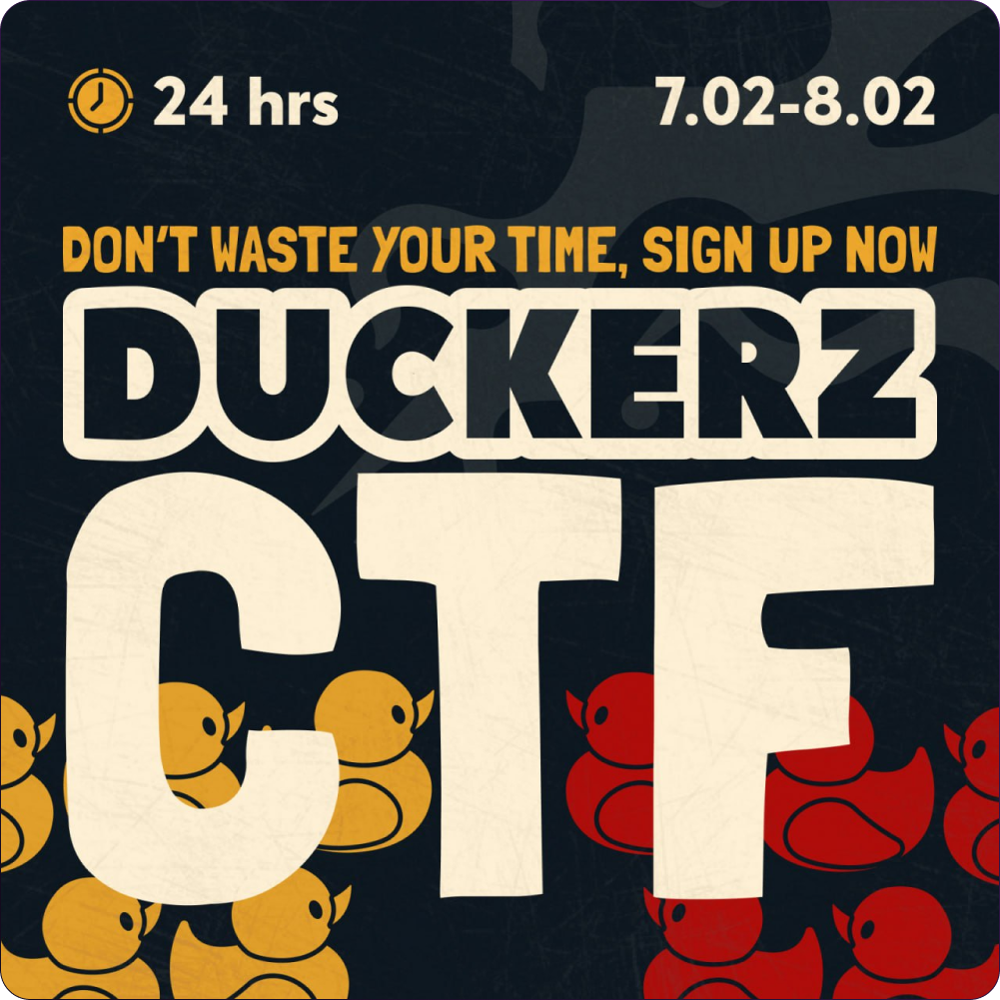

# Duckerz CTF / Write-ups

## Useful tools:
- dirsearch
- strings
- awk
- wireshark / tshark
- https://webhook.site/
- Google Earth
- JSteg
- exiftool

## Interesting links
* https://ctf101.org/forensics/what-is-stegonagraphy/
* https://infosecwriteups.com/some-common-steganography-tools-for-ctfs-92e3de93f141