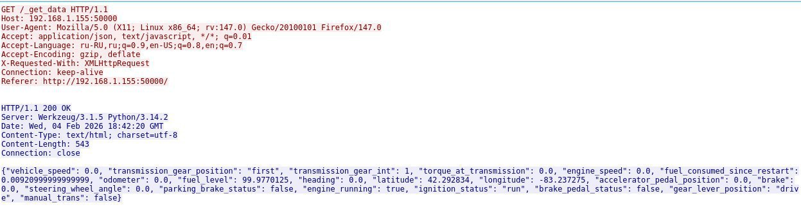
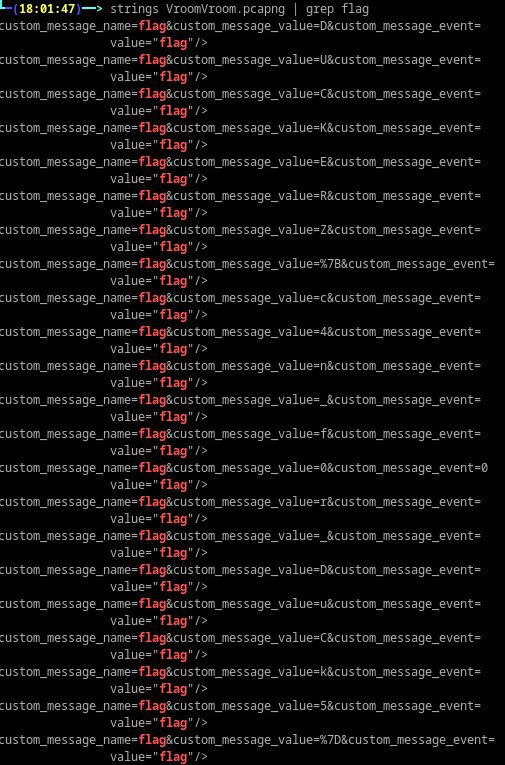
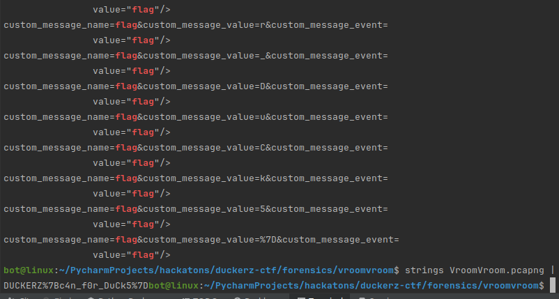
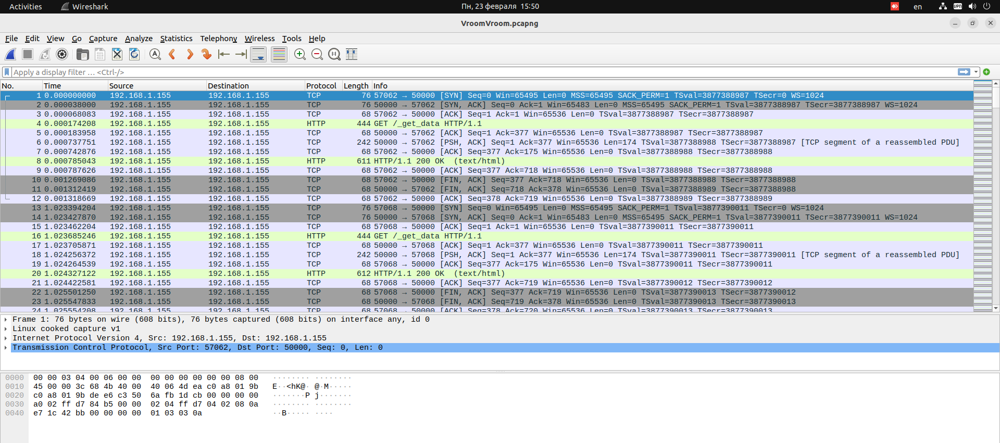
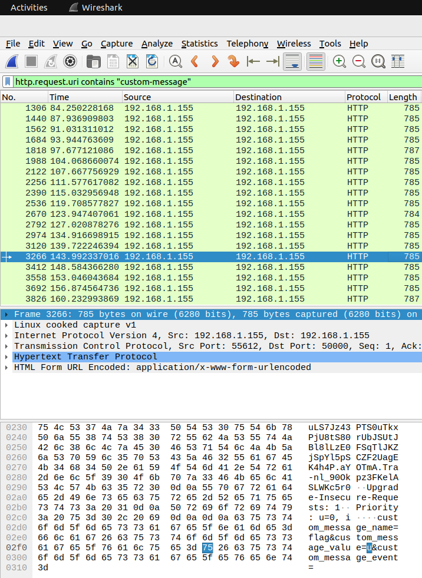

# Врум-врум отменяется

Первым делом видим http запрос и возьмём его поток (рис. 1). 



Однако в нём нет и намёка на флаг, но мы знаем что пакеты будут в json формате, 
а значит можно воспользоваться поиском по слову.

Первым словом может быть DUCKERZ, но оно отсутствует, так что попробуем слово flag (рис. 2):


Нашлась новая ручка /custom-message, в которой судя по всему побуквенно перечисляется флаг 
(custom_message_value).

Пробуем автоматизировать используя командную строку. 

И мы видим, что ничего лишнего не берётся. Воспользуемся awk и немного пошаманив получаем флаг:
```bash
strings VroomVroom.pcapng | grep flag | awk -F'=' '{ print $3 }' | awk -F'&' '{ print $1 }' | tr -d '\n'
```
Последним действием можно воспользоваться онлайн сервисом urldecode, или вручную поменять %7B и %7D на фигурные скобки



---
**PCAPNG** (Packet Capture Next Generation) - это формат файла для захвата сетевого 
трафика. Это эволюция формата .pcap. Что это значит:
* Содержит записи всех сетевых пакетов (HTTP, TCP, UDP, DNS и т.д.)
* Создается инструментами типа Wireshark, tcpdump, tshark
* Можно увидеть весь трафик между клиентом и сервером

**Суть задания:**
* В сетевом трафике спрятан флаг
* Флаг передается побуквенно через HTTP запросы
* Нужно извлечь все буквы и собрать флаг

---

Или через Wireshark



