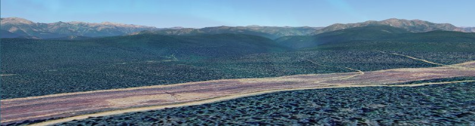

- 
- в EXIF ничего интересного вроде не нашел
- по природе подумал, что это Чарские пески, но там нет ЛЭП - визуально первоначально точку определил с точностью 550 км 😁
- наверное, по устройству ЛЭП можно сказать страну хотя бы. и как-то отследить где такие по параметрам бывают?
- публичные карты ЛЭП?

```
Google earth можно смотреть карту местности с глубиной, просто смотрели весь путь - вид гор подбираешь
```



`55.74578656280748, 109.4222665333261`

