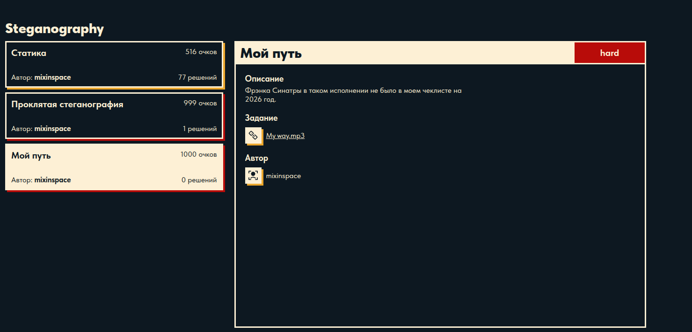
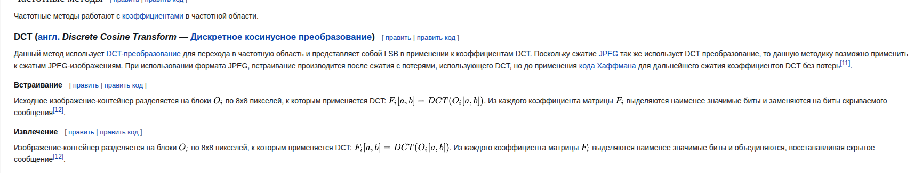
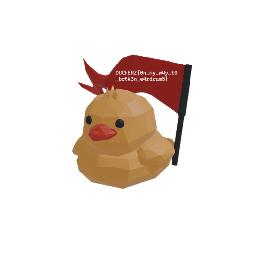

# Мой путь
`mixinspace`



Стегоконтейнер в этом таске - это обложка трека, которая хранится в APIC данных в
id3v23 секции mp3 файла.

APIC - Attached Picture

Из спецификации id3v23:
```
<Header for 'Attached picture', ID: "APIC">
Text encoding   $xx
MIME type       <text string> $00
Picture type    $xx
Description     <text string according to encoding> $00 (00)
Picture data    <binary data>
```

Если мы достанем эту картинку, мы заметим повторяющийся шум по ней, которого нет в оригинальной обложке. 


Особенно хорошо шум заметен на черном фоне, где видны синие точки.

Эти точки повторяются каждые 8х8 пикселей, а так как мы знаем, что картинка - jpeg, 
то сразу становится понятно, что что-то сделали с DCT коэффициентами.

На википедии на странице [Стеганография в цифровых изображениях](https://ru.wikipedia.org/wiki/%D0%A1%D1%82%D0%B5%D0%B3%D0%B0%D0%BD%D0%BE%D0%B3%D1%80%D0%B0%D1%84%D0%B8%D1%8F_%D0%B2_%D1%86%D0%B8%D1%84%D1%80%D0%BE%D0%B2%D1%8B%D1%85_%D0%B8%D0%B7%D0%BE%D0%B1%D1%80%D0%B0%D0%B6%D0%B5%D0%BD%D0%B8%D1%8F%D1%85) представлена такая 
информация:



Попробуем выполнить такое с нашей картинкой, выводим первые 128 битов.

```
00000000000000001000011100010010010001001010100000100111001000110100001101000010100001101000001010000000000000000000000000000011
```

Переведя в байты, получим 

```00 00 00 00 00 00 87 12 44 a8 27 23 43 42 86 82 80 00 00 03 |....Dȧ#CB......|```

Не похоже на что-то читаемое. 

Давайте посмотрим как работают другие популярные тулзы для скрытия информации в jpeg картинках с помощью lsb по DCT коэффицинтам.

### JSteg 
В статье написано, что
```json
The coefficients from the first subband u k,1, often referred to as direct current
component (DC) coefficients, represent the mean of pixel value over a k-th block 
of 8×8 pixels. The modification of those coefficients may be obvious and creates 
artifacts that can be detected easily; hence, they are usually not used for data 
hiding.
Коэффициенты первого поддиапазона u k,1 часто называемые коэффициентами постоянной 
составляющей (DC), представляют собой среднее значение яркости пикселей в k-м блоке
размером 8×8. Изменение этих коэффициентов может быть слишком заметным и приводить 
к появлению артефактов, которые легко обнаружить; по этой причине они обычно не 
используются для скрытия данных.
```

### F5
В [статье](https://link.springer.com/article/10.1186/s13640-020-00526-2) написано, что для скрытия данных они делают так:
```
Count the available non-zero alternating current (AC) coefficients and compute 
the matrix encoding parameter w based on the number of available non-zero AC 
coefficients and the message length.
Подсчитаем количество доступных ненулевых коэффициентов переменной составляющей
(AC) и вычислим параметр матричного кодирования w на основе этого количества 
и длины сообщения.
```

А также при вычислении размера стегоконтейнера они вычитают из общего количества
блоков каждый нулевой (64ый), то есть блок DC 

Также в [статье](https://pmc.ncbi.nlm.nih.gov/articles/PMC7515364/) про использование DC коэффициентов в стеганографии написано, что:

```
Traditionally, DC (quantized direct current coefficients) are not used for embedding,
due to the assumption that the embedding in DCs cause more distortion than embedding
 in ACs.
Традиционно коэффициенты DC (квантованные коэффициенты постоянной составляющей) 
не используются для встраивания данных, исходя из предположения, что модификация
 DC-коэффициентов вызывает более сильные искажения, чем встраивание в коэффициенты AC.
```

Почти во всех инструментах для стеганографии в частотном диапозоне jpeg, встраивание 
данных идет только в 63 коэффициента AC, не используя коэффициент (0,0) DC.

Поэтому в этом таске ембединг тоже идет только в AC коэффициенты, (0,0) пропускается.

Если мы запишем цепочку битов из LSB AC коэффициентов, или удалим каждый 64ый бит в строчке, полученной ранее (0й, 64й, 128й, и тд), получим такую строчку битов:

```00000000000000100001110001001001000100101010000010011100100011100011010000101000011010000010100000000000000000000000000000110110```

```00 00 00 00 00 01 0e 24 89 50 4e 47 0d 0a 1a 0a 00 00 00 0d |...$.PNG........|```

Идет 4 нулевых байта, затем еще 4 байта (это размер пейлоада), а затем header байты PNG файла

```89 50 4e 47```

Что делает солвер:

1) Достает jpeg картинку из APIC секции id3v23
2) Выполняет DCT по блокам 8х8
3) Собирает битовую строчку из LSB коэффициентов AC
4) Отрезает первые 4 байта (длина пейлоада) и записываем в файл

```bash
bot@linux:~/PycharmProjects/hackatons/duckerz-ctf/steganograpthy/myway$ pip3 install jpeglib
Defaulting to user installation because normal site-packages is not writeable
Collecting jpeglib
  Downloading jpeglib-1.0.2-cp38-abi3-manylinux2014_x86_64.manylinux_2_17_x86_64.whl (22.8 MB)
     ━━━━━━━━━━━━━━━━━━━━━━━━━━━━━━━━━━━━━━━━ 22.8/22.8 MB 8.2 MB/s eta 0:00:00
Requirement already satisfied: setuptools in /usr/lib/python3/dist-packages (from jpeglib) (59.6.0)
Requirement already satisfied: wheel in /usr/lib/python3/dist-packages (from jpeglib) (0.37.1)
Requirement already satisfied: numpy in /usr/lib/python3/dist-packages (from jpeglib) (1.21.5)
Installing collected packages: jpeglib
Successfully installed jpeglib-1.0.2
bot@linux:~/PycharmProjects/hackatons/duckerz-ctf/steganograpthy/myway$ python3 solve.py
```

После выполнения этих действий, получим PNG картинку уточки, которая держит наш флаг.



```
DUCKERZ{0n_my_w4y_t0_br0k3n_e4rdrum5}
```